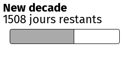
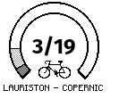
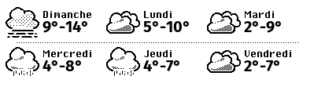

## Calendar3x4


| | value |
|---|---|
| **name** | calendar-3x4 |
| **width** | 399 |
| **height** | 480 |

### Configuration Example

```yaml
- name: calendar-3x4
  config:
    ics:
      timezone: Europe/Paris
      calendars:
      - url: https://calendar-url/french-holidays.ics
        label: Holidays
      - url: https://calendar-url/schedule.ics
        label: Schedule

```
## Countdown2x1



| | value |
|---|---|
| **name** | countdown-2x1 |
| **width** | 266 |
| **height** | 120 |

### Configuration Example

```yaml
- name: countdown-2x1
  config:
    title: New decade
    date_start: '2020-01-01'
    date_end: '2030-01-01'

```
## Velib1x1



| | value |
|---|---|
| **name** | velib-1x1 |
| **width** | 133 |
| **height** | 120 |

### Configuration Example

```yaml
- name: velib-1x1
  config:
    velib:
      station_id: 213686196

```
## WeatherRecap3x2


| | value |
|---|---|
| **name** | weather-recap-3x2 |
| **width** | 399 |
| **height** | 240 |

### Configuration Example

```yaml
- name: weather-recap-3x2
  config:
    weather:
      lat: 48.871
      lon: 2.292
      timezone: Europe/Paris

```
## WeatherWeek3x1



| | value |
|---|---|
| **name** | weather-week-3x1 |
| **width** | 399 |
| **height** | 120 |

### Configuration Example

```yaml
- name: weather-week-3x1
  config:
    weather:
      lat: 48.871
      lon: 2.292
      timezone: Europe/Paris

```
## Showcase2x1


| | value |
|---|---|
| **name** | showcase-2x1 |
| **width** | 266 |
| **height** | 120 |

### Configuration Example

```yaml
- name: showcase-2x1
  config:
    ics:
      timezone: Europe/Paris
      calendars:
      - url: https://calendar-url/french-holidays.ics
        label: Holidays
      - url: https://calendar-url/schedule.ics
        label: Schedule

```
