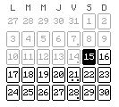
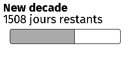
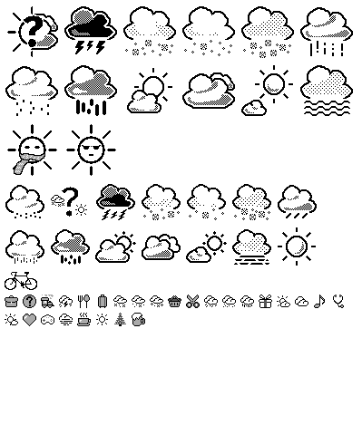
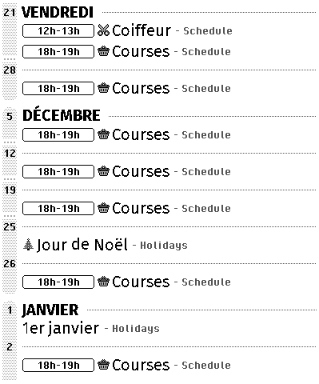
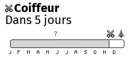
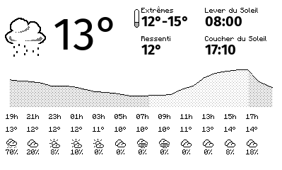
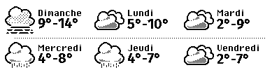

## Calendar1x1



| | value |
|---|---|
| **name** | calendar-1x1 |
| **width** | 133 |
| **height** | 120 |

### Configuration parameters

| param | type | description |
|---|---|---|
| **ics.timezone** | str | your local timezone |
| **ics.calendars[].url** | AnyHttpUrl | public URL of the ICS calendar |
| **ics.calendars[].label** | str | calendar name to display next to the events |

### Configuration Example

```yaml
- name: calendar-1x1
  config:
    ics:
      timezone: Europe/Paris
      calendars:
      - url: https://calendar-url/french-holidays.ics
        label: Holidays
      - url: https://calendar-url/schedule.ics
        label: Schedule

```
## Countdown2x1



| | value |
|---|---|
| **name** | countdown-2x1 |
| **width** | 266 |
| **height** | 120 |

### Configuration parameters

| param | type | description |
|---|---|---|
| **title** | str | title displayed on top of the widget |
| **date_start** | date | countdown start |
| **date_end** | date | countdown end |

### Configuration Example

```yaml
- name: countdown-2x1
  config:
    title: New decade
    date_start: '2020-01-01'
    date_end: '2030-01-01'

```
## DebugIcons3x4



| | value |
|---|---|
| **name** | debug-icons-3x4 |
| **width** | 399 |
| **height** | 480 |

### Configuration parameters

| param | type | description |
|---|---|---|

### Configuration Example

```yaml
- name: debug-icons-3x4
  config: {}

```
## Schedule3x4



| | value |
|---|---|
| **name** | schedule-3x4 |
| **width** | 399 |
| **height** | 480 |

### Configuration parameters

| param | type | description |
|---|---|---|
| **ics.timezone** | str | your local timezone |
| **ics.calendars[].url** | AnyHttpUrl | public URL of the ICS calendar |
| **ics.calendars[].label** | str | calendar name to display next to the events |

### Configuration Example

```yaml
- name: schedule-3x4
  config:
    ics:
      timezone: Europe/Paris
      calendars:
      - url: https://calendar-url/french-holidays.ics
        label: Holidays
      - url: https://calendar-url/schedule.ics
        label: Schedule

```
## Showcase2x1



| | value |
|---|---|
| **name** | showcase-2x1 |
| **width** | 266 |
| **height** | 120 |

### Configuration parameters

| param | type | description |
|---|---|---|
| **ics.timezone** | str | your local timezone |
| **ics.calendars[].url** | AnyHttpUrl | public URL of the ICS calendar |
| **ics.calendars[].label** | str | calendar name to display next to the events |

### Configuration Example

```yaml
- name: showcase-2x1
  config:
    ics:
      timezone: Europe/Paris
      calendars:
      - url: https://calendar-url/french-holidays.ics
        label: Holidays
      - url: https://calendar-url/schedule.ics
        label: Schedule

```
## Velib1x1


| | value |
|---|---|
| **name** | velib-1x1 |
| **width** | 133 |
| **height** | 120 |

### Configuration parameters

| param | type | description |
|---|---|---|
| **velib.station_id** | int |  |

### Configuration Example

```yaml
- name: velib-1x1
  config:
    velib:
      station_id: 213686196

```
## WeatherRecap3x2



| | value |
|---|---|
| **name** | weather-recap-3x2 |
| **width** | 399 |
| **height** | 240 |

### Configuration parameters

| param | type | description |
|---|---|---|
| **weather.timezone** | str | your local timezone |
| **weather.lat** | float | your latitude |
| **weather.lon** | float | your longitude |

### Configuration Example

```yaml
- name: weather-recap-3x2
  config:
    weather:
      timezone: Europe/Paris
      lat: 48.871
      lon: 2.292

```
## WeatherWeek3x1



| | value |
|---|---|
| **name** | weather-week-3x1 |
| **width** | 399 |
| **height** | 120 |

### Configuration parameters

| param | type | description |
|---|---|---|
| **weather.timezone** | str | your local timezone |
| **weather.lat** | float | your latitude |
| **weather.lon** | float | your longitude |

### Configuration Example

```yaml
- name: weather-week-3x1
  config:
    weather:
      timezone: Europe/Paris
      lat: 48.871
      lon: 2.292

```
